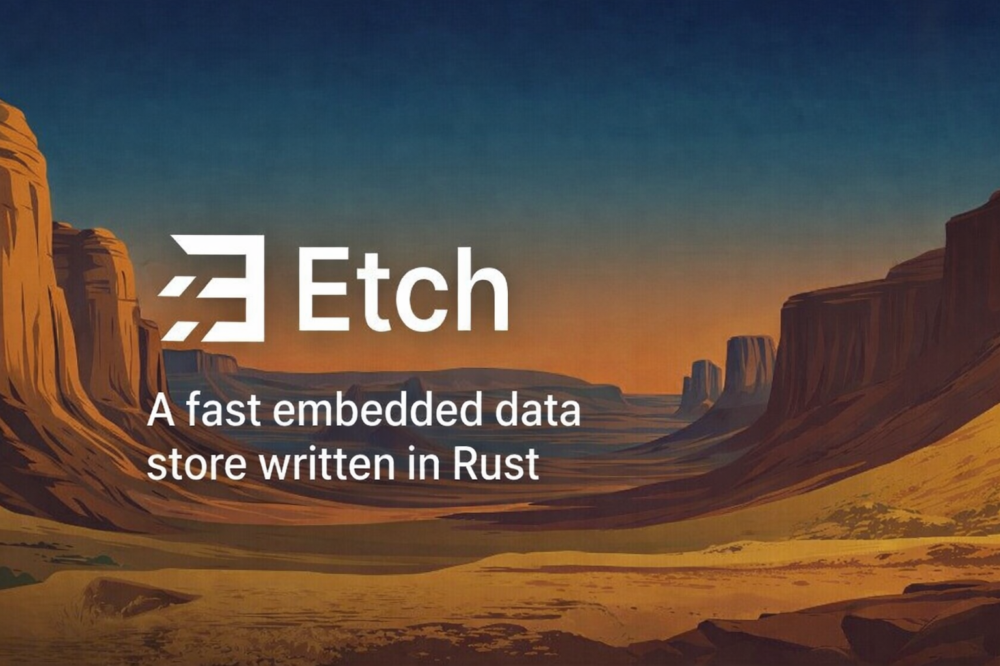

<p align="center">
  
</p>

<p align="center">
  
  
  
  
</p>

# etch

A fast, embedded database for Rust. 7 dependencies. No C code. No build scripts.

Your Rust structs live in memory, reads are direct field access through an `RwLock`, and a WAL keeps everything crash-safe on disk. No query engine, no serialization on read — just your types, persisted and durable.

## What it is

- Schema is a Rust struct — derive two traits and you're done
- Reads are direct struct access behind an `RwLock` — no deserialization, no disk I/O
- Writes are atomic and crash-safe via WAL with xxh3 integrity checksums
- 1.7M durable writes/s, 79M reads/s (per record)
- 7 dependencies, pure Rust, compiles in seconds
- Rust-only — your data is your types, with zero-overhead typed access

## What it is not

- Not a SQL database — no query language, no query engine, no joins
- Data must fit in memory — your entire state lives in a struct
- Single-process — no replication, no networking, no multi-process access
- No schema migrations — you version your types however you like

## Installation

```sh
cargo add etchdb
```

Or add to your `Cargo.toml`:

```toml
[dependencies]
etchdb = "0.3"
```

## Quick start

Define your schema as a struct and derive `Replayable` + `Transactable`:

```rust
use etchdb::{Replayable, Store, Transactable, WalBackend};
use serde::{Serialize, Deserialize};
use std::collections::BTreeMap;

#[derive(Debug, Clone, Default, Serialize, Deserialize, Replayable, Transactable)]
struct Music {
    #[etch(collection = 0)]
    artists: BTreeMap<String, Artist>,
}

#[derive(Debug, Clone, Serialize, Deserialize)]
struct Artist { name: String, genre: String }
```

That's it — the derive macros handle the rest.

```rust
// Open a file-backed store (or Store::<Music>::memory() for tests)
let store = Store::<Music, WalBackend<Music>>::open_wal("data/".into()).unwrap();

// Write — tx.artists is a Collection with typed get/put/delete
store.write(|tx| {
    tx.artists.put("radiohead".into(), Artist { name: "Radiohead".into(), genre: "alt rock".into() });
    tx.artists.put("coltrane".into(), Artist { name: "John Coltrane".into(), genre: "jazz".into() });
    Ok(())
}).unwrap();

// Read — direct struct access, no deserialization
let state = store.read();
assert_eq!(state.artists["coltrane"].name, "John Coltrane");
```

See the full examples:

| Example | What it shows |
|---|---|
| [`hello_derive`](examples/hello_derive.rs) | In-memory todo list — derive macros |
| [`hello`](examples/hello.rs) | In-memory todo list — manual trait impls |
| [`contacts`](examples/contacts.rs) | Persistent contacts book — CRUD with WAL that survives restarts |

```sh
cargo run --example hello_derive
cargo run --example hello
cargo run --example contacts
```

## Features

- **Derive macros** — `#[derive(Replayable, Transactable)]` eliminates ~60 lines of boilerplate per state type
- **Async support** — `AsyncStore::open_wal` + async `write`/`flush` for tokio runtimes via `block_in_place`
- **Snapshot compaction** — WAL auto-compacts after a configurable threshold, with optional zstd compression (`compression` feature)
- **Two flush modes** — immediate fsync or grouped batching for throughput
- **Zero-clone writes** — `Overlay` + `Transactable` captures changes without cloning state
- **BTreeMap and HashMap** — generic key types (`String`, `Vec<u8>`, integers) via `EtchKey` trait
- **Pluggable backends** — `WalBackend`, `NullBackend`, or bring your own
- **Corruption recovery** — truncates incomplete WAL entries, keeps valid prefix

## Performance

Apple M4 Pro, `--release`. Run yourself: `cargo bench`

Each operation is one record — a single struct read or written.

| Operation | Throughput |
|---|---|
| Read | 79M/s |
| Insert | 2.4M/s |
| Update | 2.2M/s |
| WAL insert (1K per commit) | 220K/s |
| WAL insert (100K per commit) | 1.7M/s |
| WAL insert (1M per commit) | 1.7M/s |
| WAL reload (10M records) | 3.8s |

## License

MIT
